# <div align="center"> Pet Paws  </div>

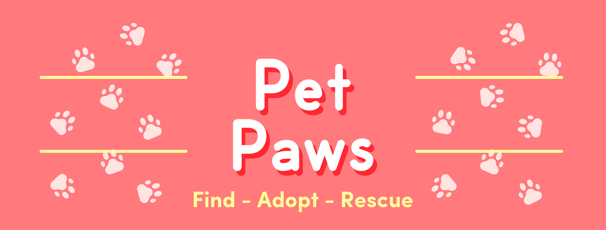

<p style="text-align: justify;"><b>Pet Paws</b> es una aplicación web moderna dedicada a la adopción de mascotas y a la búsqueda de animales perdidos. Conectamos rescatistas, albergues y personas que buscan adoptar o han perdido a sus animales de compañía, facilitando la difusión de casos y creando una comunidad enfocada en darles a los animales un hogar. Permite la gestión de perfiles de mascotas, publicaciones relacionadas con ellas, y la autenticación de usuarios. Utiliza tecnologías modernas como React, Tailwind CSS, y Vite para ofrecer una experiencia de usuario rápida y eficiente.</p>

**Puedes encontrarnos:**
<div>
<a href="https://www.facebook.com/PetPawsApp" style="margin-right: 15">
  
</a>
&nbsp;
<a href="https://www.instagram.com/petpawsapp" style="margin-right: 15">
  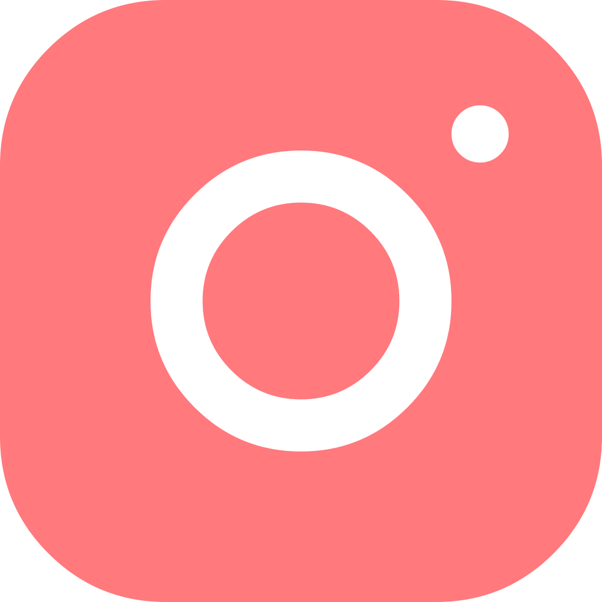
</a>
&nbsp;
<a href="#">
  
</a>
</div>

<br>

> [!NOTE]
> Nuestro proyecto busca mejorar la calidad de vida de otras especies. Invitamos a todos a colaborar de forma altruista para alcanzar este objetivo.

## Tecnologías Utilizadas
Este proyecto ha sido desarrollado utilizando un conjunto de tecnologías modernas para garantizar su escalabilidad, eficiencia y una experiencia de usuario optimizada. A continuación, se listan las principales herramientas y tecnologías empleadas:

### Frontend
<div>

  &nbsp;

  &nbsp;

  &nbsp;

  &nbsp;

</div>

### Backend

<div>

  &nbsp;

</div>

### Base de Datos


### Cloud & Hosting

<div>

  &nbsp;

  &nbsp;

</div>

### Media & Archivos


### Testing


## UI Design

### Definición de colores y fuentes

Para garantizar una experiencia de usuario atractiva y accesible, hemos seleccionado una paleta de colores cálida y amigable, así como dos tipografías que destacan por su enfoque suave y moderno.

**Fuentes**

- **Odin Rounded**: Una fuente con puntas redondeadas que evoca cercanía y simpatía, ideal para hacer que los usuarios se sientan cómodos navegando en la aplicación.
- **Sofia Pro**: Una tipografía versátil con una estructura redondeada que mantiene un equilibrio entre modernidad y simplicidad, proporcionando legibilidad y un diseño limpio.

**Esquema de colores**

El esquema de colores se basa en un contraste por brillo que garantiza tanto accesibilidad como una estética visualmente coherente y atractiva. Los tonos cálidos y suaves ayudan a transmitir una sensación de cuidado y conexión emocional con las mascotas:

<div>
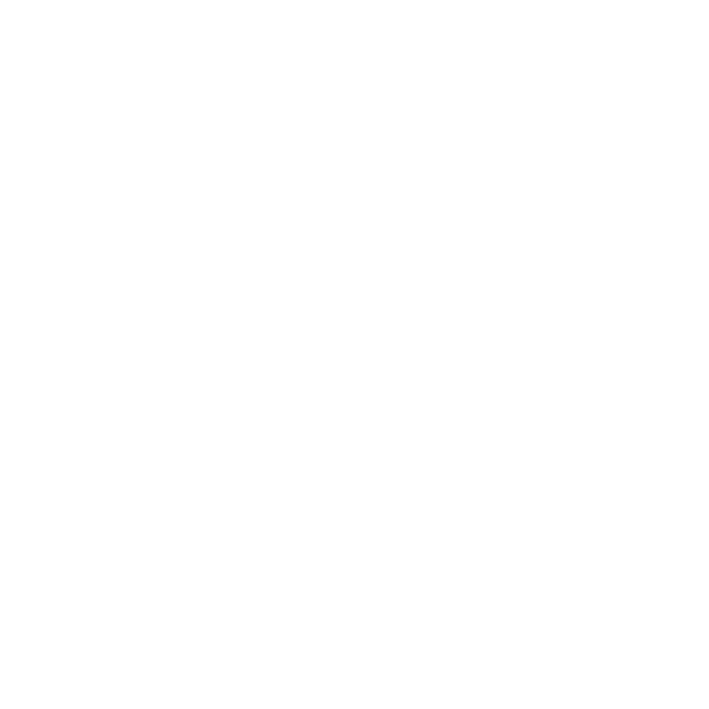
  &nbsp;
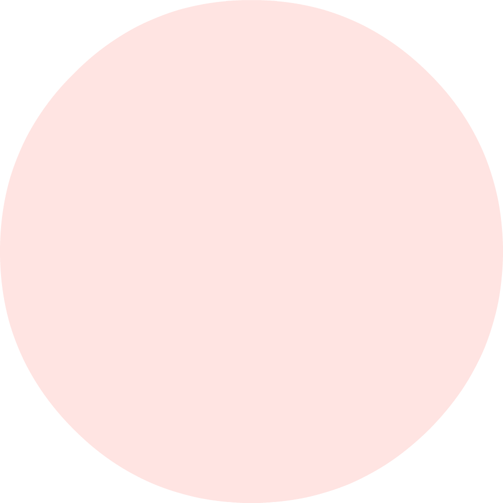
  &nbsp;
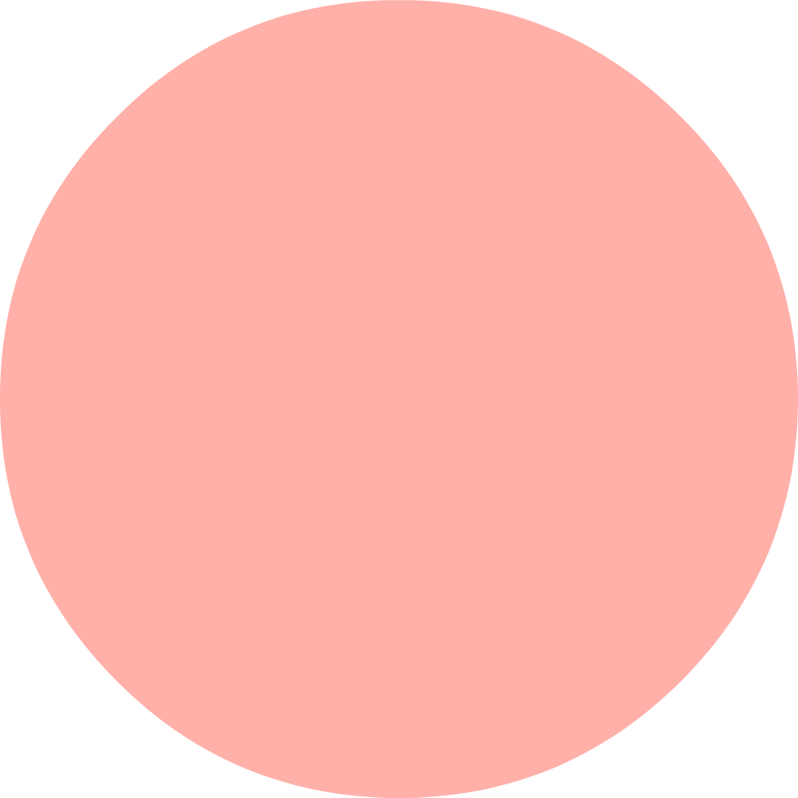
  &nbsp;
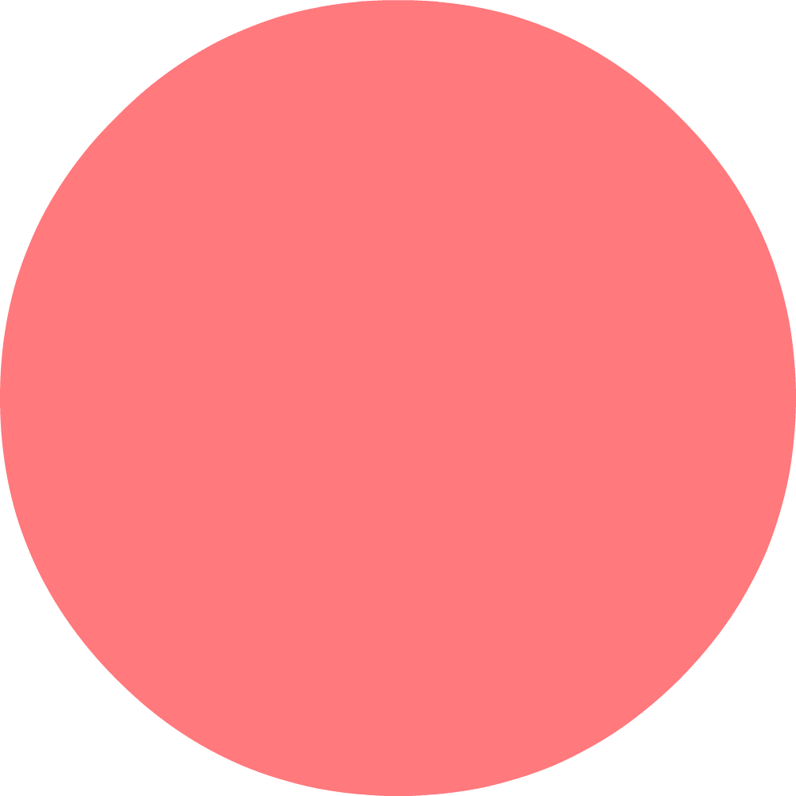
  &nbsp;
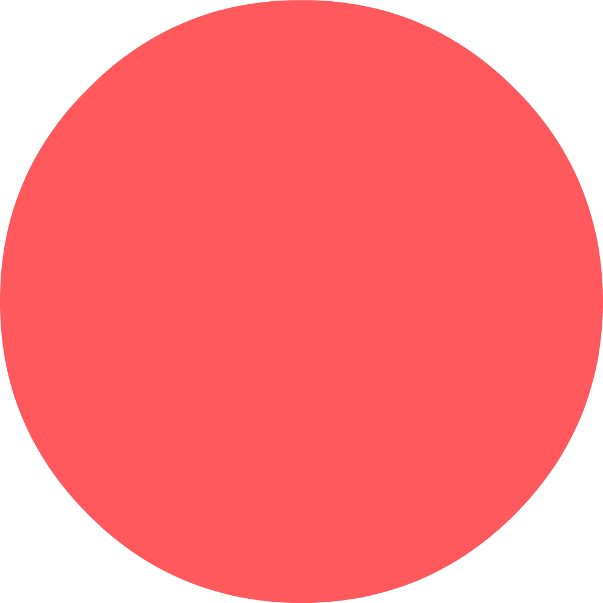
  &nbsp;

  &nbsp;

  &nbsp;

  &nbsp;

</div>

`#FFFFFF`
`#FFE4E2`
`#FFB0A9`
`#FF797D`
`#FF585D`
`FF353A`
`FF252F`
`#D9534F`
`#C9302C`

### WireFrames
Se utilizo programas como **Paint** y **SketchBook** para la realización de los wireframes.

<div>
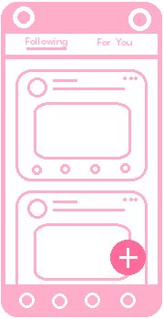
  &nbsp;
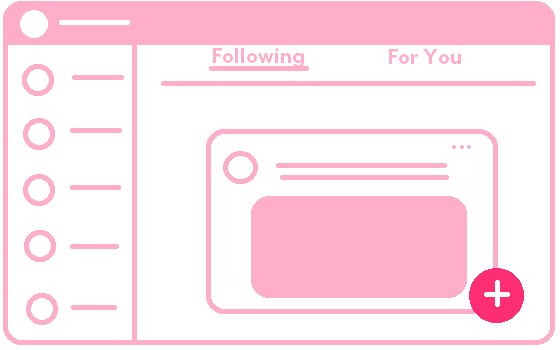
</div>

### Mockups

La aplicación se basa en los siguiente MockUps realizados en Figma, tanto para diseño mobile y desktop.

<div>
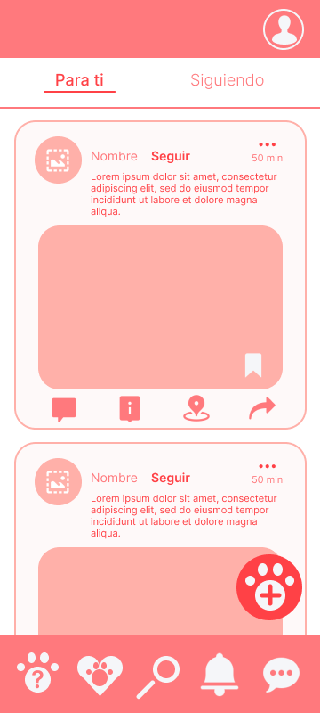
  &nbsp;
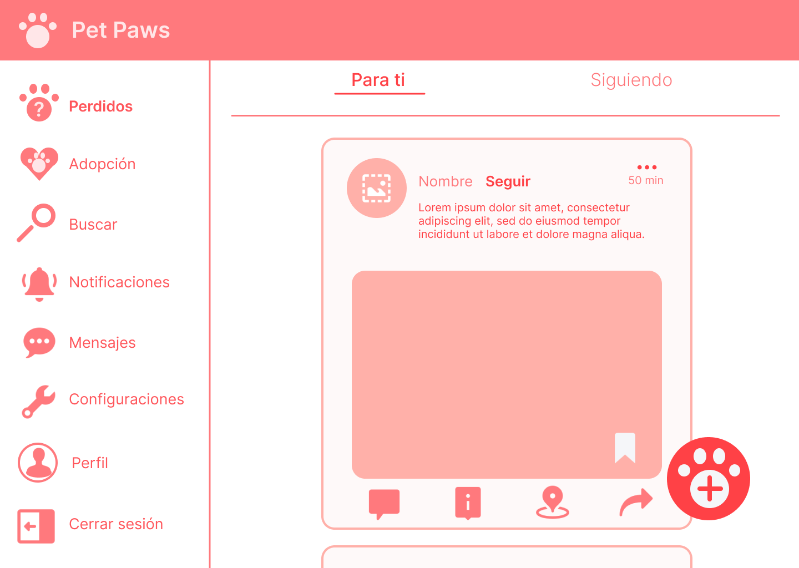
</div>

- Encuentra todos los MockUps en Figma:

<a href="https://www.figma.com/design/QdrT1X1tpDvgPlli9pRl2J/Pet-Paws?node-id=0-1&node-type=canvas&t=wXHANSG2u6jNZMI5-0">
  
</a>

### Iconos, Ilustraciones y Animaciones
Para la creación de los elementos visuales y animaciones utilizados en la plataforma, se han empleado las siguientes herramientas:

<div>

  &nbsp;

  &nbsp;

  &nbsp;
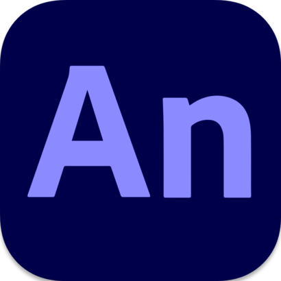
  &nbsp;

  &nbsp;

  &nbsp;

</div>
<br>

> [!CAUTION]
> Toda la iconografia, ilustraciones, animación y cualquier diseño dentro del proyecto (menos la que **NO** es de color `#FF797D` dentro del Readme) como los enlaces añadidos, tienen derecho de autor; si piensas usarlos contactarse primero con [**Noelia Garcia Pacara**]([https://github.com/NoeliaGAP](https://www.linkedin.com/in/noelia-gap/)) y preguntar si pueden usarlos colocando **créditos al autor**, pero solo sí son trabajos para **fines NO comerciales**.

<br>


## Características Principales

- **Gestión de Usuarios**: Registro y autenticación de usuarios con validación de códigos.
- **Perfiles de Mascotas**: Creación y gestión de perfiles de mascotas.
- **Publicaciones**: Los usuarios pueden crear y visualizar publicaciones relacionadas con sus mascotas.
- **Internacionalización**: Soporte multilingüe utilizando `react-i18next`.
- **Interfaz de Usuario Moderna**: Estilizada con Tailwind CSS para una apariencia limpia y moderna.
- **Desarrollo Rápido**: Configurado con Vite para un entorno de desarrollo rápido y eficiente.

Pueden encontrar más información en: 

<a href="https://legard2911.atlassian.net/jira/software/projects/MIRPG/boards/1">
  </a>

## Configuración y Scripts

- **Configuración de Linter y Formateo**:
  - `.editorconfig`, `.gitignore`, `.husky/`, `.lintstagedrc`, `commitlint.config.js`, `eslint.config.js`, `postcss.config.js`, `tailwind.config.js`, `vite.config.js`
  - Scripts de configuración y herramientas para mantener la calidad del código y la consistencia en el desarrollo.

- **Archivos Principales**:
  - `index.html`: Archivo HTML principal.
  - `package.json`: Dependencias y scripts del proyecto.
  - `README.md`: Documentación del proyecto.

- **Directorio `src/`**:
  - **Componentes**: [src/components/](src/components/)
    - Componentes reutilizables de la interfaz de usuario.
  - **Contextos**: [src/contexts/](src/contexts/)
    - Manejo del estado global de la aplicación.
  - **Hooks**: [src/hooks/](src/hooks/)
    - Hooks personalizados para lógica reutilizable.
  - **Internacionalización**: [src/i18n.jsx](src/i18n.jsx)
    - Configuración de `react-i18next` para soporte multilingüe.
  - **Locales**: [src/locales/](src/locales/)
    - Archivos de traducción.
  - **Servicios**: [src/services/](src/services/)
    - Lógica de interacción con APIs y servicios externos.
  - **Vistas**: [src/views/](src/views/)
    - Páginas principales de la aplicación.

## Instalación

1. Clona el repositorio:
    ```sh
    git clone https://github.com/tu-usuario/pet-paw.git
    ```

2. Navega al directorio del proyecto:
    ```sh
    cd pet-paw
    ```
3. Instala las dependencias:
    ```sh
    npm install
    ```
4. Inicia el servidor de desarrollo:
    ```sh
    npm run dev
    ```
5. Inicia el servidor json-server
    ```
    npm run apí
    ```

## Validación de Usuarios

La validación de usuarios es clave para garantizar la seguridad y confianza en la plataforma:

- **Resgistro simulado**: Los usuarios pueden crear una cuenta a través de un proceso simulado de registro, lo que asegura una experiencia fluida y sencilla.
- **Inicio de Sesión Simulado**: El inicio de sesión es rápido y simple, permitiendo a los usuarios volver a sus cuentas para gestionar sus publicaciones.
- **Código de Verificación Simulado**: Se simula la verificación del usuario a través de un código enviado a su correo o número de teléfono, mejorando la seguridad de las cuentas.

Próximamente, implementaremos versiones reales de estas características con almacenamiento de datos seguro y verificación por correo electrónico/SMS.

## Historias de Usuario Implementadas

A continuación, se listan las principales historias de usuario que han sido desarrolladas hasta el momento:

1. **Publicar Mascotas Perdidas**: Los usuarios pueden crear publicaciones para reportar mascotas perdidas o avistadas.

2. **Idioma de la Aplicación**: La plataforma soporta múltiples idiomas, lo que permite a los usuarios interactuar en su lengua preferida.

3. **Registro de Usuario**: Los nuevos usuarios pueden registrarse en la plataforma para acceder a todas las funcionalidades.

4. **Inicio de Sesión**: Los usuarios existentes pueden iniciar sesión rápidamente para continuar gestionando sus mascotas o publicaciones.

5. **Visualización de Publicaciones**: Todos los usuarios pueden visualizar las publicaciones de mascotas perdidas, encontradas o disponibles para adopción.

6. **Detalles de la Publicación**: Cada publicación muestra información detallada sobre la mascota, como el tipo, la raza, la descripción y el contacto del dueño.

## Próximamente

A corto plazo:
- **Verificación de Usuarios Real**: Implementaremos la validación completa de usuarios utilizando correos electrónicos y códigos SMS reales.
- **Gestión de Perfiles de Mascotas**: Ampliaremos las opciones para que los usuarios gestionen más detalles sobre sus mascotas.
- **Notificaciones en Tiempo Real**: Las notificaciones sobre avistamientos y mensajes de otros usuarios serán parte de una actualización futura.
- **Mejora de pantalla "Settings"**: Colocar **eliminar cuenta** dentro de edición de perfil.

A largo plazo:

- **Colocar insignias distintivas en usuarios**: Facilitando la busqueda de albergues, santuarios, temporales y rescatistas.
- **Agregar directorio de veterinarias**: Facilitar a los usuarios la búsqueda de veterinarias recomendadas a través de MapBox con información detallada sobre ubicación y horarios.
- **Promoción de la adopción de gatos adultos, con FIV+ o leucemia**: Implementar filtros específicos para buscar gatos adultos, con FIV+ o leucemia. Además, que las secciones de adopción destaquen este tipo de públicaciones para aumentar la visibilidad y cantidad de adopción de estos casos.

Con **Pet Paws**, estamos construyendo una comunidad segura y rápida para ayudar a las personas a reencontrarse con sus mascotas perdidas o encontrar hogares para animales en situación de abandono.

Puedes encontrar más información respecto al proyecto en:

<a href="https://drive.google.com/drive/folders/1uL-igDqA1zyCBIwnc70UI95ipyvCxQeI?usp=drive_link">
  
</a>

## Autores

- GitHub - [Noelia Garcia Pacara](https://github.com/NoeliaGAP)
- GitHub - [William Lupaca Ticona](https://github.com/PunoBootcamper)
- Github - [Augusto Perales Guevara](https://github.com/AEperalesguevara)
- GitHub - [David Paredes Abanto](https://github.com/davidchano)


## Contribuciones

1. Realiza un fork del repositorio.
2. Crea una nueva rama para tu feature: `git checkout -b feature/nueva-feature`.
3. Realiza tus cambios y confirma tus commits: `git commit -m 'Añadida nueva-feature'`.
4. Envía tus cambios: `git push origin feature/nueva-feature`.
5. Abre un Pull Request.

Puedes encontrar la comunidad de **Discord** para aquellos que deseen contribuir:

<a href="https://discord.gg/nmFkjq57">
  
</a>

<br>

> [!IMPORTANT]
>Si eres desarrollador y compartes nuestra pasión por los animales y la tecnología, ¡te invitamos a colaborar! Tu código puede ayudar a mejorar la experiencia de usuario y a expandir nuestro alcance. A cambio, tu nombre se incluirá en la lista de contribuidores del proyecto.
